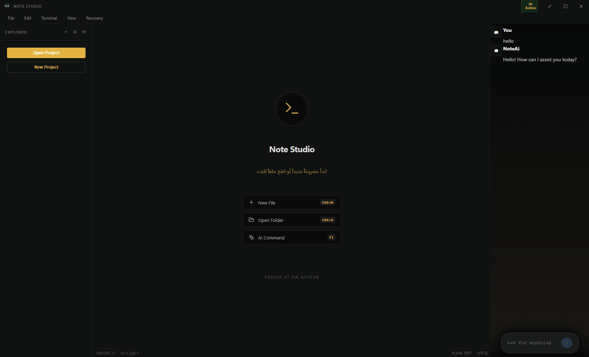

https://capsule-render.vercel.app/api?type=waving&height=300&color=gradient&text=Yasser%2027
# 🚀 Note Studio AI - v4.9.0 PRO

[Note Studio AI](https://yasser-27.github.io/Note-Studio-Ai/)

**Note Studio AI** is a cutting-edge, lightweight Integrated Development Environment (IDE) built for developers who prioritize privacy, speed, and local AI capabilities. It integrates a powerful **Local LLM** that runs directly on your machine, providing AI assistance without needing an internet connection.

---

## ✨ Key Features

* **🤖 Offline AI (Local LLM):** Code assistance that stays on your hardware. Your data never leaves your computer.
* **⚡ Extreme Performance:** Minimal resource footprint (CPU/RAM) with instant-response architecture.
* **🎨 Pro UI/UX:** A sleek, modern dark interface designed for long coding sessions.
* **🔒 Privacy-First:** Zero data tracking. 100% offline-first AI processing.
* **💾 Smart Auto-Save:** Advanced system that secures your work every 10 minutes.
* **🌐 3D Visual Experience:** Interactive web landing page with 3D-perspective feature showcases.

---

## 📸 Screenshots

 
 

---

# v4.9.1
Latest Updates:

*  AI Engine: Integrated a powerful new model with advanced logical reasoning.

*  Chat Experience: Launched a modern AI chat interface with enhanced features.

*  Management Tools: Added options to save, delete, and export conversations to PDF.

Stability: Resolved various bugs and improved overall system performance.

[Download Now](https://github.com/YASSER-27/Note-Studio-Ai/releases/tag/4.9.1)

## 🛠️ Tech Stack

* **Electron.js** - For a robust cross-platform desktop experience.
* **React** - Powering a dynamic and responsive User Interface.
* **Local LLM Runtimes** - Efficiently executing AI models on local hardware.
* **CSS3 & JavaScript** - Advanced 3D effects and site security.

---

## 🚀 Getting Started

1.  Download the latest installer from the [Releases](https://github.com/yasser-27/Note-Studio-Ai/releases) section.
2.  Run the setup and follow the instructions.
3.  Launch **Note Studio AI** and start coding smarter!

---

## 🛡️ Security & Protection

The web showcase for this project includes anti-tampering measures to prevent unauthorized source code inspection, protecting the intellectual property of the **Note Studio** ecosystem.

---
if ai not work install Latest supported v14 (for Visual Studio 2017–2026) x64
## 👨‍💻 Developer
**Yassir27** - Visionary & Lead Developer of Note Studio AI.

---
© 2026 Yassir27 - Note Studio AI. All rights reserved.
